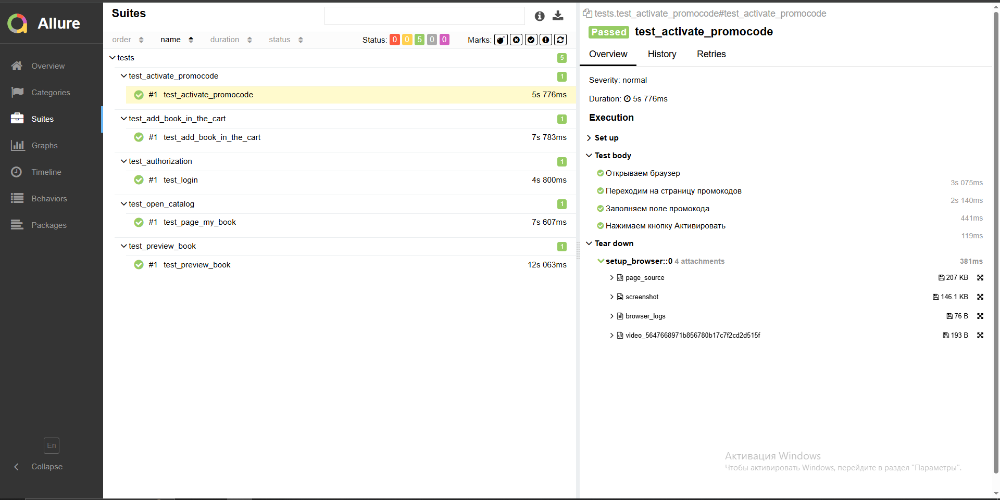
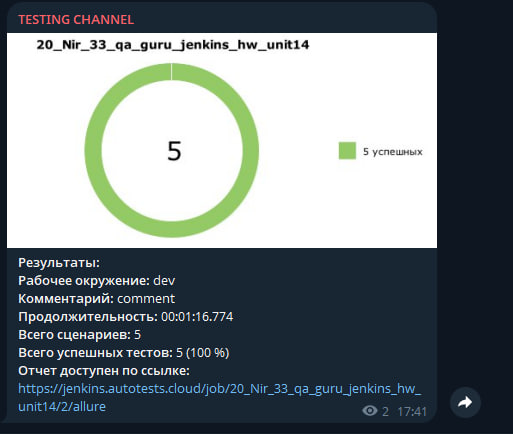

# Домашнее задание к уроку школы QA.GURU

---

## О проекте

---

Автоматизированные UI-тесты для litres.ru

Рассмотрены следующие сценарии:

- **Авторизация пользователя в системе** 
- **Активация промокода**
- **Добавление книги в корзину**
- **Открытие каталога книг**
- **Открытие превью книги**

# Технологический стек

---

- **Python 3.13**
- **Selene**
- **Pytest**
- **Allure**
- **Jenkins**
- **Selenoid**

# Allure report

# Телеграмм-бот

